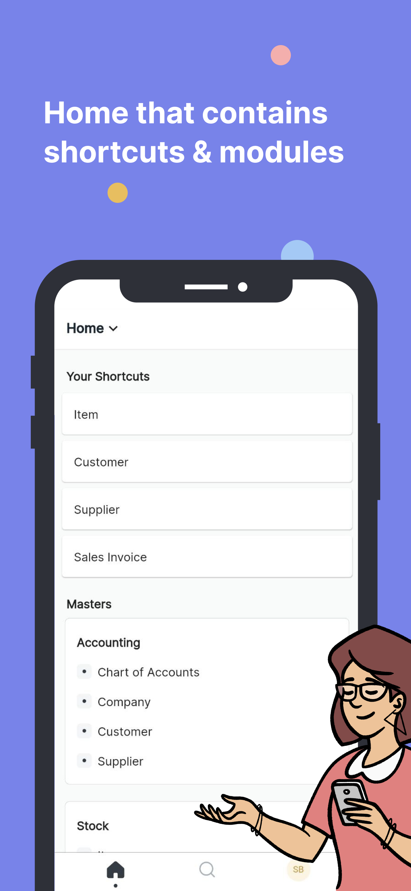
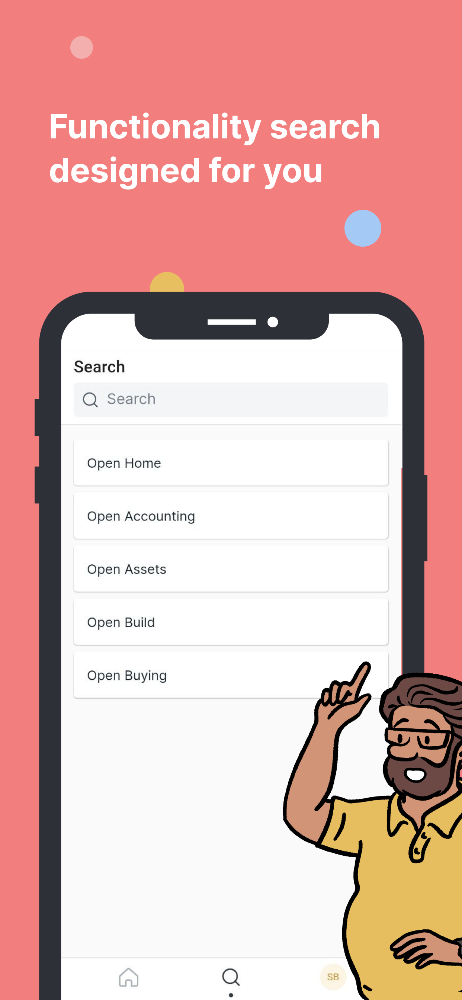
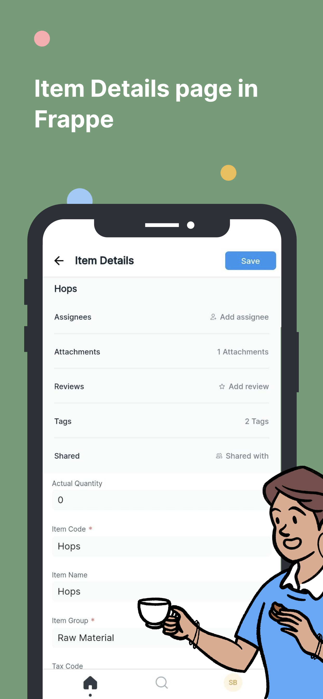

# Frappe Mobile

Access your ERPNext desk or any other Frappe desk anytime from your smartphone.

<kbd></kbd>
<kbd></kbd>
<kbd></kbd>

## Features:
1) Create/Update Docs
2) Add/Remove Assignees, Tags
3) Add/Remove/Download Attachments 
4) Add Comments, Send Email
5) Appreciate/Criticize Users involved in specified Doc.
6) Timeline
7) Awesombar
